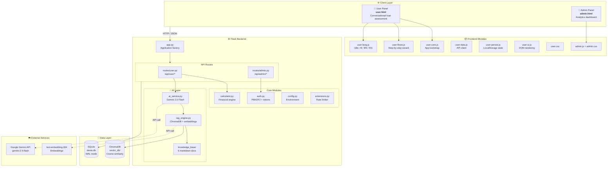
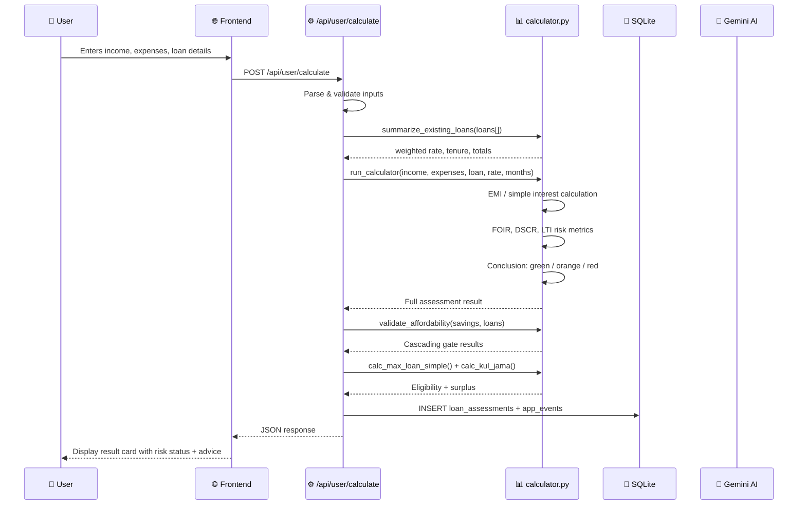
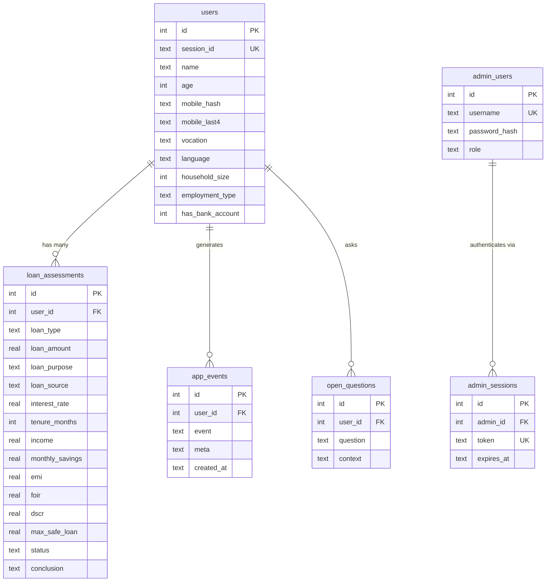
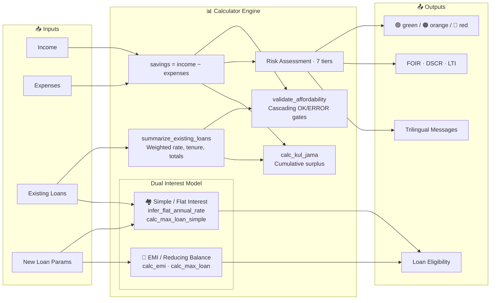

# DARAS – दारस | Aapka Vittiya Mitra

A Hindi-first financial literacy web app for underprivileged Indians. Helps users understand their loan situation — EMI, max safe loan amount, and debt risk status (Green / Orange / Red).

## Run

```bash
cd backend
python3 -m venv venv
pip install -r requirements.txt

# Development
APP_ENV=dev venv/bin/uvicorn server:app --host 127.0.0.1 --port 5001 --reload
```

- User app → http://localhost:5001
- Admin panel → http://localhost:5001/admin/panel

## Test

The test suite spins up its own isolated uvicorn server with a throwaway database — no server needs to be running beforehand.

All test dependencies are included in `requirements.txt`. API and browser tests share the same setup:

```bash
cd backend
venv/bin/playwright install chromium   # one-time, for browser tests
venv/bin/pytest tests/backend_test.py -v                              # API only
venv/bin/pytest tests/backend_test.py tests/browser_test.py -v       # API + browser
```

## Environment

| Variable | Default (dev) | Required in production |
|---|---|---|
| `APP_ENV` | `dev` | Set to `production` to enable safety checks |
| `DARAS_SECRET` | `daras-dev-secret-change-in-prod` | Any long random string |
| `ADMIN_USER` | `daras_admin` | Custom username |
| `ADMIN_PASS` | `Daras@2024` | Strong password |
| `DB_PATH` | `daras.db` | Writable path for SQLite file |
| `ALLOWED_ORIGINS` | `*` | Comma-separated list of allowed origins |

When `APP_ENV=production`, the server **refuses to start** if any of the above are still at their dev defaults.

## Stack

- **Backend:** Flask + SQLite, served via `uvicorn` (ASGI)
- **UI:** `backend/user.html` (user flow), `backend/admin.html` (admin analytics)
- **Languages supported:** Hindi, Bengali, English

## Key Features

- Conversational loan assessment (income, EMI, debt ratio)
- Green / Orange / Red risk classification
- Admin dashboard with visitor stats, cross-tab analytics, open questions
- Duplicate mobile detection with Resume / Start Over flow

---

## Architecture

### System Overview



### Request Flow — Loan Assessment



### Database Schema



### Calculator Engine — Dual Interest Model



### Project Structure

```
DARAS V3/
├── README.md
├── Final Calc Model Daras V3.xlsx     # Excel reference model
└── backend/
    ├── app.py                          # Flask app factory
    ├── server.py                       # Uvicorn ASGI entry
    ├── config.py                       # Environment variables
    ├── db.py                           # SQLite + migrations
    ├── auth.py                         # Admin auth (PBKDF2)
    ├── calculator.py                   # 🧮 Financial engine
    ├── ai_service.py                   # 🤖 Gemini integration
    ├── rag_engine.py                   # 📚 ChromaDB RAG pipeline
    ├── routes/
    │   ├── user.py                     # /api/user/* endpoints
    │   └── admin.py                    # /api/admin/* endpoints
    ├── knowledge_base/                 # RAG source documents
    │   ├── rbi_lending_guidelines.md
    │   ├── government_schemes.md
    │   ├── pm_mudra_yojana.md
    │   ├── pm_svanidhi.md
    │   ├── debt_recovery_rights.md
    │   └── financial_literacy_faqs.md
    ├── static/                         # Frontend JS/CSS
    ├── user.html                       # User-facing SPA
    ├── admin.html                      # Admin dashboard
    ├── privacy.html                    # Privacy policy
    └── tests/                          # Pytest + Playwright
```

---

## Built by

**Ishika** &nbsp;|&nbsp; कोडर एवं सक्षमकर्ता — *The Enabler*

दारस ऐप के पीछे की तकनीकी दिमाग़।
Concept को कोड में बदलने वाली — from a Hindi-first UX vision to a full-stack RAG-powered web app built for the people who need it most.

She designed the product, wrote the backend, shaped the financial engine, and shipped it — all driven by the belief that financial literacy should be accessible in every language, to every Indian.
